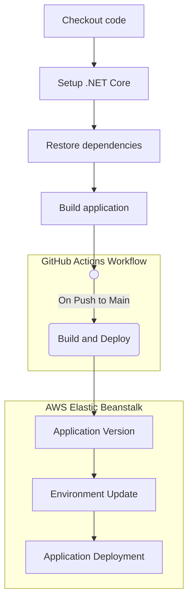

# CI/CD usando github actions y aws elastic beanstalk para una Api Rest construida en .Net

Esta API Rest fue construida con C# y .NET, y proporciona información meteorológica con datos dummies. El bjetivo de este proyecto consiste en demostrar un flujo básico
de integración y despliegue continuo usando github actions y aws elastic beanstalk.

### ¿Qué es Amazon Elastic Beanstalk y por qué lo use?
Amazon Elastic Beanstalk es un servicio en la nube que permite a los desarrolladores implementar y administrar aplicaciones web de forma rápida y sencilla. Ofrece una plataforma completamente administrada para la implementación de aplicaciones y reduce la complejidad de administrar la infraestructura necesaria para mantener las aplicaicones.

Entre los beneficios de utilizar Amazon Elastic Beanstalk podemos mencionar los siguientes:
- **Facilidad de uso:** Amazon Elastic Beanstalk es fácil de usar y reduce la complejidad de administrar la infraestructura subyacente. Como desarrolladores podemos enfocarnos en la codificación de la aplicación en lugar de preocuparnos por la administración de la infraestructura.
- **Escalabilidad:** Amazon Elastic Beanstalk puede ajustarse automáticamente a las demandas de tráfico.
- **Alta disponibilidad:** Amazon Elastic Beanstalk proporciona una alta disponibilidad de las aplicaciones mediante la implementación de varias instancias en diferentes zonas de disponibilidad.
- **Compatibilidad con múltiples lenguajes y frameworks:** Amazon Elastic Beanstalk es compatible con varios lenguajes de programación, incluyendo Java, Python, PHP, .NET, Node.js y Ruby. También es compatible con varios frameworks, como Express, Flask y Spring.

### Integración y Despliegue Continuo
Este proyecto incluye un archivo .yml que permite la integración y despliegue continuo utilizando GitHub Actions y Amazon Elastic Beanstalk. Esto significa que cada vez que se realizan cambios en el código, la aplicación se compila, prueba y despliega automáticamente en Elastic Beanstalk.

Podemos visualizar el flujo con el siguiente diagrama:

### Requisitos

Para construir el pipeline en github actions es necesario que contemos con la siguiente acción que podemos encontrar en marketplace de github [einaregilsson/beanstalk-deploy@v21](https://github.com/marketplace/actions/beanstalk-deploy)

### Referencias
- ["¿Qué es AWS Elastic Beanstalk?"](https://docs.aws.amazon.com/es_es/elasticbeanstalk/latest/dg/Welcome.html) Guía para desarrolladores de aws
